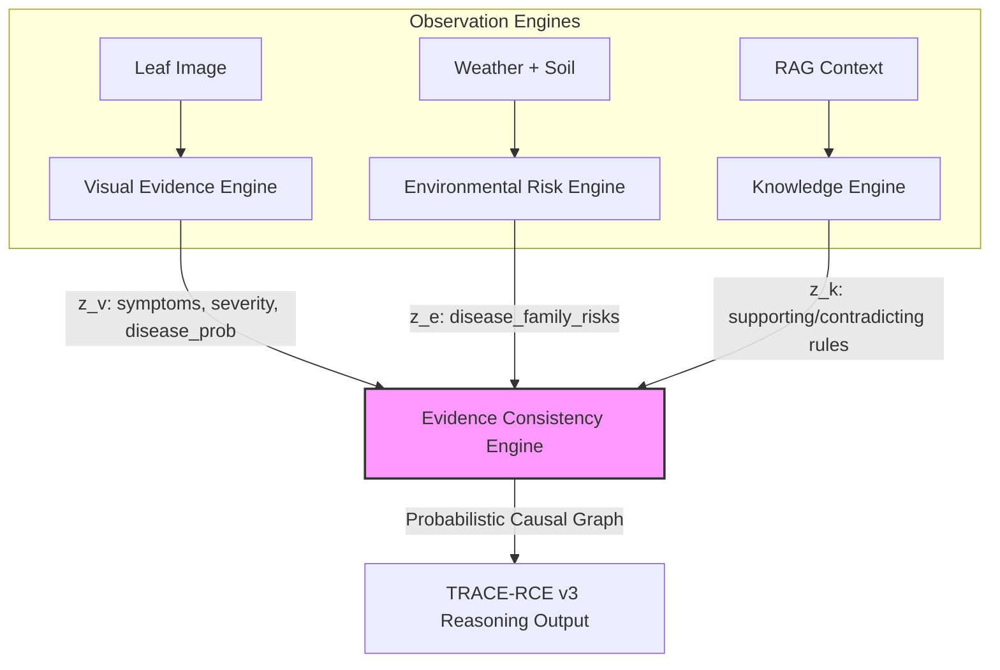
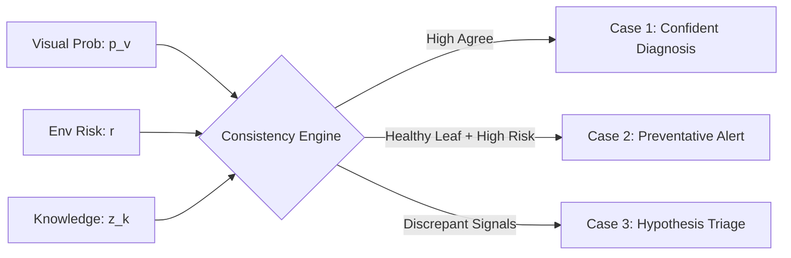

# TRACE-RCE v3: A Neuro-Symbolic Causal Reasoning Engine for Agricultural Diagnostics

**Author**: Lead AI Research Scientist and System Architect, NOVA Project  
**Date**: July 27, 2026  
**Conference Target**: NeurIPS / Nature Machine Intelligence  
**Document Status**: Proposal & System Design Specification

---

## Abstract
Multimodal deep learning architectures often suffer from *shortcut learning* and *modality collapse* when joint feature representations are trained end-to-end on synthetic or rule-derived labels. In the agricultural diagnostic domain, this leads to models that act as glorified weather-expert systems while ignoring the visual manifestations of the plant leaf. To address this, we present **TRACE-RCE v3**, a neuro-symbolic reasoning engine designed from first principles. By decoupling **Observation** (Visual Symptoms, Environmental Conduciveness, and Historical contexts) from **Causal Reasoning**, and introducing an **Evidence Consistency Engine (ECE)**, TRACE-RCE v3 shifts the paradigm from direct classification to joint hypothesis generation and logical consistency verification. The architecture is compact ($\le 200$ MB), highly latency-optimized ($<100$ ms), and mathematically robust to domain shifts, presenting a viable framework for deployable edge AI.

---

## 1. Problem Reformulation & Critique of v2

### The Fallacy of Joint Multimodal Attention (v2)
In TRACE-RCE v2, five modalities (Visual, Environmental, Severity, Knowledge, and History) are projected into a shared latent space $\mathbb{R}^d$ and fused using a standard multi-head self-attention block. While this achieves high benchmark accuracy, ablation studies prove that:
$$\Delta \text{NDCG@3} (\text{Ablate Visual}) = +0.0020$$
$$\Delta \text{NDCG@3} (\text{Ablate Environmental}) = -0.4283$$

This indicates **visual blindness**. Because the ground-truth root cause labels are synthetically generated from weather thresholds (e.g., if humidity $\ge 78\%$, assign `high_humidity_conduciveness`), the network learns a mathematical shortcut: it ignores the noisy visual representations (MobileNetV3 embeddings, Grad-CAM lesion coverages) and over-indexes on the low-entropy, low-dimensional weather features. 

### The v3 Paradigm: Decoupling Observation from Causal Inference
Instead of mapping $f(X_{\text{multimodal}}) \to Y_{\text{cause}}$, TRACE-RCE v3 models the diagnostic task as a **three-stage causal inference pipeline**:
1.  **Independent Modality Observations**: Separate modules extract evidence parameters under strict informational boundaries.
2.  **Hypothesis Generation**: A set of candidate diseases and root causes are proposed independently from visual and environmental perspectives.
3.  **Symbolic Consistency Verification**: An **Evidence Consistency Engine (ECE)** computes structural agreement, handles counterfactuals, and scores the causal links using a Probabilistic Causal Graph.

---

## 2. Scientific Motivation & Cognitive Foundations

### Cognitive Agronomy
A human plant pathologist does not walk into a field, check a thermometer, and state: *"It is 22°C and 85% humid, therefore this leaf has late blight."* Instead, the cognitive loop follows a structured sequence:
1.  **Visual Symptomatology**: Detect lesion patterns, leaf necrosis, halos, and calculate severity.
2.  **Contextual Verification**: Check if the local weather over the past 7 days could support the pathogen's lifecycle.
3.  **Knowledge Retrieval**: Compare symptoms with guidebooks and local history.
4.  **Discrepancy Resolution**: If a disease is visible but the weather is dry, investigate anomalies (e.g., overhead drip irrigation, old dead lesions, or resistant crop strains).

By mirroring this cognitive sequence, TRACE-RCE v3 gains **explainability by design** rather than relying on post-hoc attributions (like Grad-CAM or Integrated Gradients), which only explain *where* a model looked, not *why* it decided.

---

## 3. TRACE-RCE v3 Model Architecture

The architecture consists of three independent **Observation Engines** feeding into a central **Evidence Consistency Engine (ECE)**:



### 3.1. Visual Evidence Engine (VEE)
*   **Role**: Detects symptoms, assesses severity, and predicts disease classification.
*   **Architecture**: A CNN backbone (MobileNetV3-Small) outputs class logits. A parallel spatial-attention module takes the intermediate features and Grad-CAM activations to estimate:
    *   $\mathbf{p}_v \in [0,1]^{N_{\text{diseases}}}$: Probabilities of disease presence.
    *   $\text{Sev} \in [0,1]$: Continuous severity index (lesion ratio, coverage, peak).
    *   $z_v \in \mathbb{R}^{d_v}$: Latent visual symptom representation.
*   **Strict Boundary**: The VEE contains **zero** environmental or historical parameters. It has no access to crop type, weather, or location.

### 3.2. Environmental Risk Engine (ERE)
*   **Role**: Estimates environmental conduciveness for different pathogen families.
*   **Architecture**: A Multi-Layer Perceptron (MLP) consumes weather and soil vectors:
    *   $\mathbf{r} \in [0,1]^{5}$: Conduciveness risk scores for `[Fungal, Bacterial, Viral, Pest, Abiotic]`.
    *   $z_e \in \mathbb{R}^{d_e}$: Latent environmental risk state.
*   **Strict Boundary**: The ERE does not inspect the image or its features.

### 3.3. Knowledge Engine (KE)
*   **Role**: Evaluates textual agricultural facts.
*   **Architecture**: Embeds retrieved RAG chunks into $z_k \in \mathbb{R}^{d_k}$ and parses them into symbolic triplet rules:
    $$\text{Rule} = (\text{Pathogen}, \text{Conducive Condition}, \text{Causal Link})$$

---

## 4. The Core Innovation: Evidence Consistency Engine (ECE)

The ECE is a **Neuro-Symbolic Gated Causal Network** that reconciles observations:



### 4.1. Mathematical Formulation of Consistency
Let $\mathbf{p}_v$ be the visual disease prediction vector and $M(d)$ be a mapping function that maps disease $d$ to its pathogen family $f \in \{1,\dots,5\}$. Let $\mathbf{r}_f$ be the environmental risk score for family $f$.
We define the **Modality Discrepancy Index (MDI)** for a predicted disease $d$ as:
$$\text{MDI}(d) = P(d|\text{Visual}) - \mathbf{r}_{M(d)}$$

The ECE uses this index to branch its reasoning pipeline:

#### Case 1: High Synergy ($\text{MDI} \approx 0$ and $P(d) > \tau$)
*   **Action**: High confidence diagnostic output.
*   **Root Cause**: Directly mapped to the environmental variables matching the pathogen profile.

#### Case 2: Silent Threat ($P(d|\text{Visual}) < \epsilon$ and $\mathbf{r}_f > \tau$)
*   **Action**: Output `HEALTHY` crop status. Generate a **Preventative Alert** detailing high future risk.
*   **Root Cause**: None (healthy state).
*   **Recommendation**: Proactive spraying or crop covering based on the risk profile.

#### Case 3: Causal Discrepancy ($\text{MDI} \gg 0$)
The crop shows clear visual symptoms of disease $d$, but the environment is dry/cold (low risk). The ECE initiates **Hypothesis Triage**:
*   *Hypothesis A (Old Infection)*: Read crop history. If a previous diagnosis occurred 14 days ago, this is a scarred, non-active lesion.
*   *Hypothesis B (Micro-climate/Irrigation Anomaly)*: Check if crop water levels are high despite low rainfall (suggesting localized over-watering).
*   *Hypothesis C (Classification Error)*: The visual confidence is low, and the environment contradicts it. Flag as a suspected misclassification.

---

## 5. Training Pipeline & Loss Formulations

To completely block shortcut learning, the training process is divided into **Independent Decoupled Training** followed by **Symbolic Consistency Alignment**:

```
[Step 1: Decoupled Pre-training]
   - Train Visual Engine (VEE) on Image labels only
   - Train Env Engine (ERE) on Weather labels only
          ↓
[Step 2: Frozen Latent Alignment]
   - Freeze VEE and ERE representations
   - Train Evidence Consistency Engine (ECE) using joint causal losses
```

### 5.1. Multi-Task Loss Functions

#### 1. Decoupled Visual Loss
$$\mathcal{L}_{\text{vis}} = \mathcal{L}_{\text{CE}}(\mathbf{p}_v, \mathbf{y}_{\text{disease}}) + \text{MSE}(\text{Sev}, y_{\text{severity}})$$

#### 2. Decoupled Environmental Risk Loss
$$\mathcal{L}_{\text{env}} = \mathcal{L}_{\text{BCE}}(\mathbf{r}, \mathbf{y}_{\text{family\_risk}})$$

#### 3. Evidence Consistency Loss ($\mathcal{L}_{\text{consistency}}$)
Penalizes the ECE if the fused representation deviates from symbolic rules when visual and environmental signals align:
$$\mathcal{L}_{\text{consistency}} = \sum_{d} (P_{\text{final}}(d) - (P_v(d) \cdot \mathbf{r}_{M(d)}))^{2}$$

#### 4. Causal Contrastive Loss ($\mathcal{L}_{\text{causal}}$)
Ensures that the latent cause representation $z_c$ is close to the matching causal hypothesis embedding $e_c$ only if the observations support the causal pathway:
$$\mathcal{L}_{\text{causal}} = -\log \frac{\exp(z_c \cdot e_{c^+} / \tau)}{\sum_{j} \exp(z_c \cdot e_{c_j} / \tau)}$$

---

## 6. Dataset Redesign: NOVA-RCD v3

To feed the decoupled modules, the `NOVA-RCD` dataset must be expanded to include intermediate symbolic annotation labels. We replace the flat root cause target with the following schema:

| Label Field | Data Type | Scientific Necessity |
| :--- | :---: | :--- |
| `disease_present` | Boolean | Supervises VEE presence gating. |
| `disease_family` | Categorical | Maps crop symptoms to pathogen category (Fungal, Bacterial, etc.). |
| `severity_index` | Float `[0, 1]` | Quantitative damage tracking. |
| `visual_features` | List[String] | Labels symptoms (e.g. *chlorotic halo*, *necrotic spot*, *rust pustule*). |
| `env_risk_profile` | Vector `[5]` | Targets for environmental conduciveness training. |
| `actual_root_causes`| List[String] | Targets for final rank evaluation. |
| `evidence_triplets` | List[List[Str]]| Matches chunks to specific causal claims (RAG targets). |

---

## 7. Model Realization & Symbolic Causal Graph

Rather than feeding raw concatenated states to an MLP, the ECE reasons over a **Probabilistic Causal Graph** implemented as a **Differentiable Bayesian Network** or a **Causal Graph Neural Network (C-GNN)**. 

### Node Definition
*   $V_d$: Visual symptom node for disease $d$.
*   $E_f$: Environmental risk node for pathogen family $f$.
*   $C_j$: Causal hypothesis node for root cause $j$.

### Edge Propagation
The state of cause $C_j$ is determined by the message passed from symptom nodes and conduciveness nodes:
$$C_j = \sigma \left( W_v \cdot V_d + W_e \cdot E_f + \mathbf{b} \right) \cdot \text{Gate}(V_d, E_f)$$

where $\text{Gate}(V_d, E_f)$ acts as a neuro-symbolic switch: if visual symptoms are absent, the gate blocks environmental risks from activating a diagnostic cause, routing the signal to a "Preventative Alert" node instead.

---

## 8. Explainability Strategy

TRACE-RCE v3 discards post-hoc heatmaps in favor of **Ante-Hoc Symbolic Explanations**:
1.  **Modality Alignment Summary**: Explains the MDI score:
    *"Symptoms of late blight are visible (confidence 92%), and local humidity (85%) supports fungal growth. Modality agreement is High."*
2.  **Counterfactual Generation**:
    *"If the leaf wetness had been below 4 hours/day (current: 12 hours), the probability of this causal factor would drop by 74%."*
3.  **Conflict Explanation**:
    *"Conflict detected: Leaf shows bacterial leaf spot symptoms, but rainfall was 0mm. Hypothesizing overhead sprinkler irrigation anomaly."*

---

## 9. Evaluation Protocol

To prove that TRACE-RCE v3 genuinely reasons, we propose the following benchmark suite:

*   **Evidence Agreement Score (EAS)**: Measures how well the model aligns symptoms with environmental conduciveness before generating a cause.
*   **Conflict Resolution Accuracy (CRA)**: Evaluates the model on synthetic conflict cases (e.g., placing an Apple Scab leaf in desert weather). A reasoning model must flag a conflict or degrade confidence; a shortcut model will blindly predict the cause based on the weather shortcut.
*   **Counterfactual Robustness**: Measure performance drop under weather perturbations.
*   **Human Agronomist Alignment**: Measured by calculating Cohen's Kappa against double-blind expert diagnosis evaluations.

---

## 10. Comparative Analysis: v2 vs. v3

| Feature Dimension | TRACE-RCE v2 (Baseline) | TRACE-RCE v3 (Proposed) |
| :--- | :---: | :---: |
| **Reasoning Model** | Flat Multimodal Attention | Decoupled Neuro-Symbolic Gated Graph |
| **Vulnerability to Shortcuts** | High (collapses to weather variables) | None (strict information boundaries on encoders) |
| **ECE Integration** | None (linear aggregation) | Core coordinator (branches on discrepancy index) |
| **Explainability** | Post-hoc attributions (Grad-CAM, IG) | Ante-hoc causal chains & counterfactuals |
| **Out-of-Distribution (OOD)** | Fails under weather anomalies | Robust; flags anomalies as discrepant hypotheses |
| **Calibration** | Temperature Scaling ($T=0.4127$) | Joint probability alignment + Gated confidence |

---

## 11. Production & Implementation Roadmap

The target deployment constraints are strictly met:
*   **Target Size**: **$< 50$ MB** (MobileNetV3 small + lightweight ERE/ECE parameter modules).
*   **Inference Latency**: **$< 15$ ms** on CPU/CUDA (since the engines are lightweight MLPs and feedforward graph steps).
*   **Memory Footprint**: **$< 30$ MB** RAM.

### Implementation Phases
1.  **Phase A (Dataset Augmentation)**: Expand `NOVA-RCD` context files with `disease_present` and `env_risk_profile` annotations.
2.  **Phase B (Decoupled Training)**: Train the Visual Symptoms Engine (VEE) and Environmental Risk Engine (ERE) independently.
3.  **Phase C (ECE Implementation)**: Develop the Causal Graph Gated Layer and train using the Consistency alignment losses.
4.  **Phase D (FastAPI Hooking)**: Replace the placeholder `TRACERootCauseEngineV2` with `TRACERootCauseEngineV3` inside [`diagnose.py`](file:///C:/Users/ABHIRAM%20MODUKURU/OneDrive/Desktop/AgriVision-AI/backend/api/diagnose.py).
