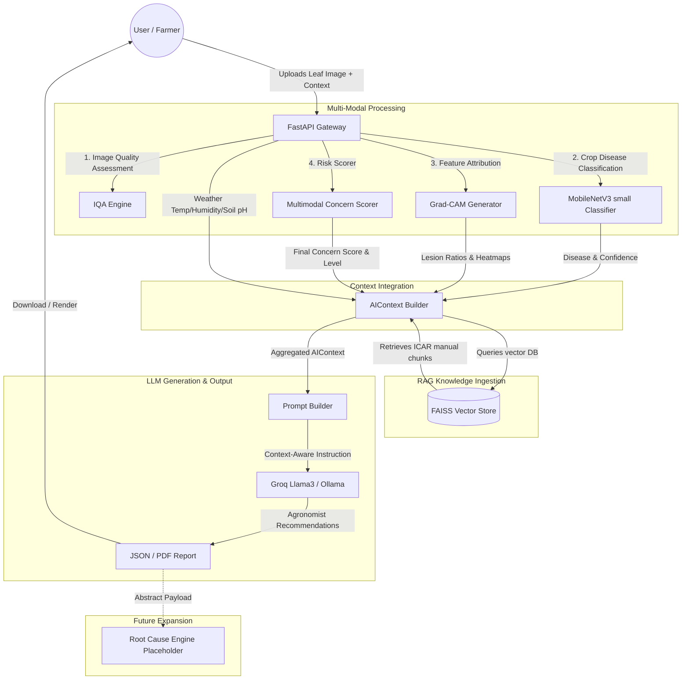

# NOVA System Architecture Blueprint

This document details the architectural layers and data flow patterns of the **Neural Optimized Vision Assistant (NOVA)**.

---

## 🏗️ Structural Overview

NOVA is structured around a decoupled, local-first multi-modal processing pipeline.

---

## 🔄 Multi-Modal Data Flow Sequence

1. **Leaf Image Ingestion**: The FastAPI router `/api/v1/diagnose/` accepts a multipart form containing the leaf image, current average temperature, humidity, soil pH, GPS coordinates, and user identifier.
2. **Vision Prediction & Feature Map Extraction**:
   * The image is routed to the MobileNetV3 small neural network.
   * Test-Time Augmentation (TTA) computes averaged class logits.
   * Grad-CAM intercepts the final convolutional layer (`features.7`) to produce heatmaps highlighting visual attention.
3. **Multimodal Concern Scoring**: The `MultimodalConcernScorer` computes a final score combining classification confidence, lesion area ratios, humidity, pH, temperature, and specific growth stages.
4. **Context Construction**: The `AIContextBuilder` aggregates vision outputs, GradCAM coordinates, weather parameters, and RAG knowledge.
5. **Report Compilation**: The PDF report endpoint `/api/v1/report` compiles a highly structured ReportLab document embedding the leaf image, GradCAM visual heatmap overlay, and RAG recommendations.
6. **Structured Production Logging**: Every request is monitored, logging execution latencies, device tags, and transaction identifiers.
