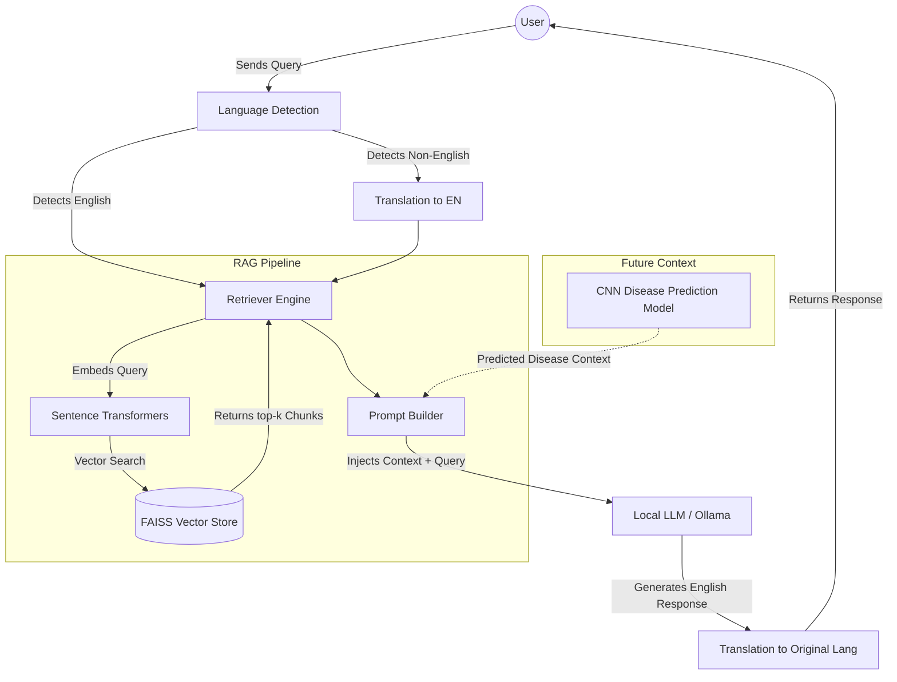
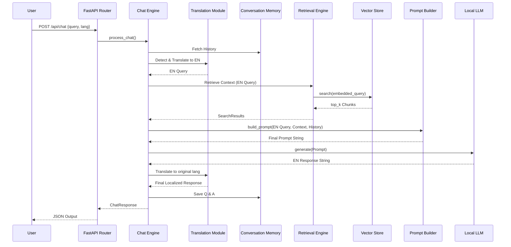

# Zenith AgriBot - Architecture Design

## Overview
Zenith AgriBot is an enterprise-grade, multilingual Retrieval-Augmented Generation (RAG) chatbot designed to run locally using open-source models, avoiding reliance on paid external APIs.

## Architecture Diagram

## Data Flow Diagram

## Core Principles
1. **Clean Architecture**: Separation of concerns. The API layer knows nothing about how FAISS works.
2. **SOLID**: Abstract base classes define behavior; specific implementations handle exact technologies.
3. **Local First**: Prioritizing offline, secure inference to respect data privacy and bandwidth constraints.
