# GRADCAM BASELINE AUDIT

This document verifies whether the baseline MobileNetV3-Small attends to actual disease lesions (causally relevant regions) or relies on background artifacts.

## Category: Correct High

### Sample 1
- **True Class:** corn_gray_leaf_spot
- **Predicted Class:** corn_gray_leaf_spot
- **Confidence:** 0.8113
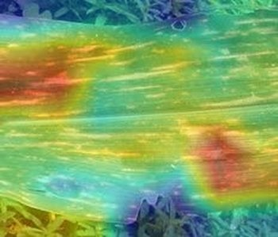

### Sample 2
- **True Class:** corn_leaf_blight
- **Predicted Class:** corn_leaf_blight
- **Confidence:** 0.8026
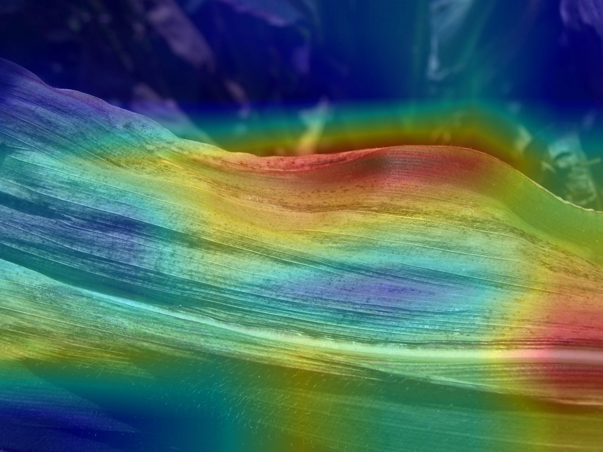

### Sample 3
- **True Class:** corn_leaf_blight
- **Predicted Class:** corn_leaf_blight
- **Confidence:** 0.9460
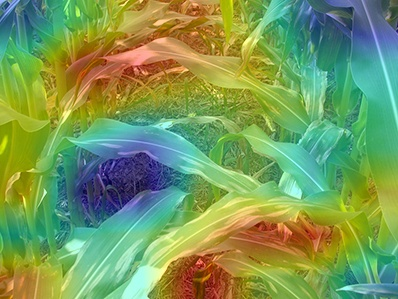

### Sample 4
- **True Class:** corn_leaf_blight
- **Predicted Class:** corn_leaf_blight
- **Confidence:** 0.8763
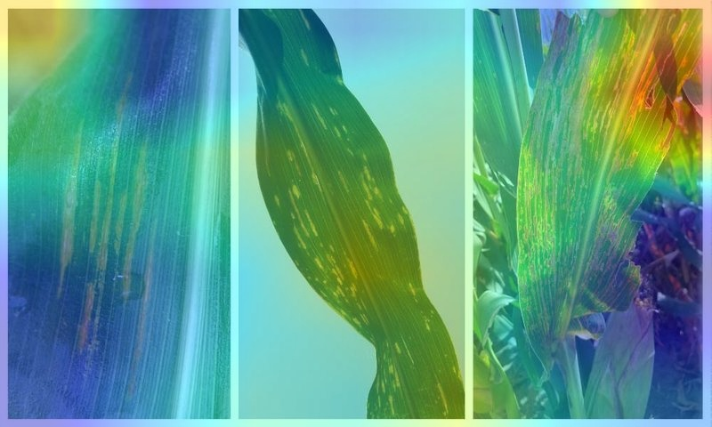

## Category: Correct Low

### Sample 1
- **True Class:** corn_gray_leaf_spot
- **Predicted Class:** corn_gray_leaf_spot
- **Confidence:** 0.3068
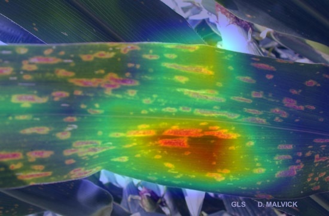

### Sample 2
- **True Class:** corn_gray_leaf_spot
- **Predicted Class:** corn_gray_leaf_spot
- **Confidence:** 0.4942
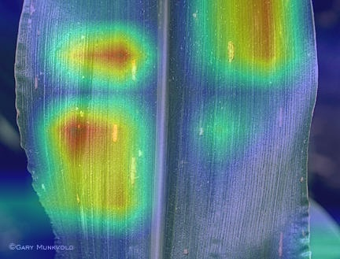

### Sample 3
- **True Class:** corn_leaf_blight
- **Predicted Class:** corn_leaf_blight
- **Confidence:** 0.4755
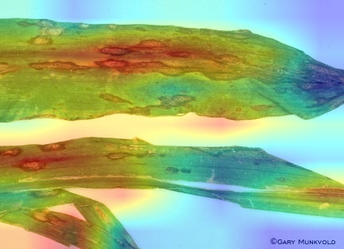

### Sample 4
- **True Class:** corn_leaf_blight
- **Predicted Class:** corn_leaf_blight
- **Confidence:** 0.4158
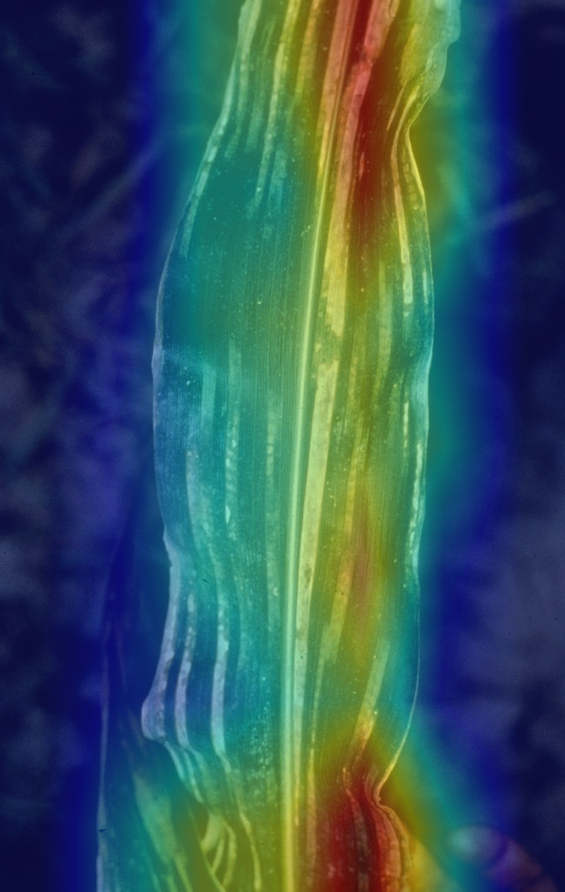

## Category: Incorrect High

### Sample 1
- **True Class:** potato_late_blight
- **Predicted Class:** tomato_late_blight
- **Confidence:** 0.8764
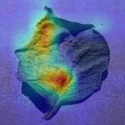

### Sample 2
- **True Class:** rice_leaf_blast
- **Predicted Class:** rice_bacterial_leaf_blight
- **Confidence:** 0.9001
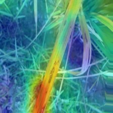

### Sample 3
- **True Class:** tomato_spider_mites_two_spotted_spider_mite
- **Predicted Class:** tomato_target_spot
- **Confidence:** 0.8339
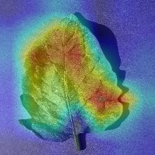

## Category: Incorrect Low

### Sample 1
- **True Class:** corn_gray_leaf_spot
- **Predicted Class:** corn_leaf_blight
- **Confidence:** 0.3303
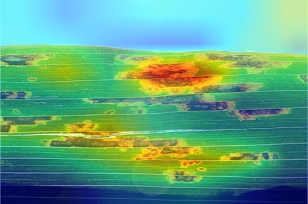

### Sample 2
- **True Class:** corn_gray_leaf_spot
- **Predicted Class:** corn_leaf_blight
- **Confidence:** 0.3876
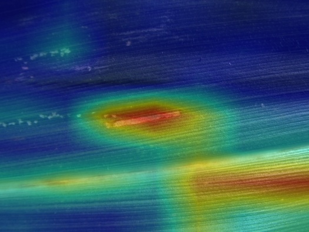

### Sample 3
- **True Class:** corn_gray_leaf_spot
- **Predicted Class:** corn_leaf_blight
- **Confidence:** 0.4776
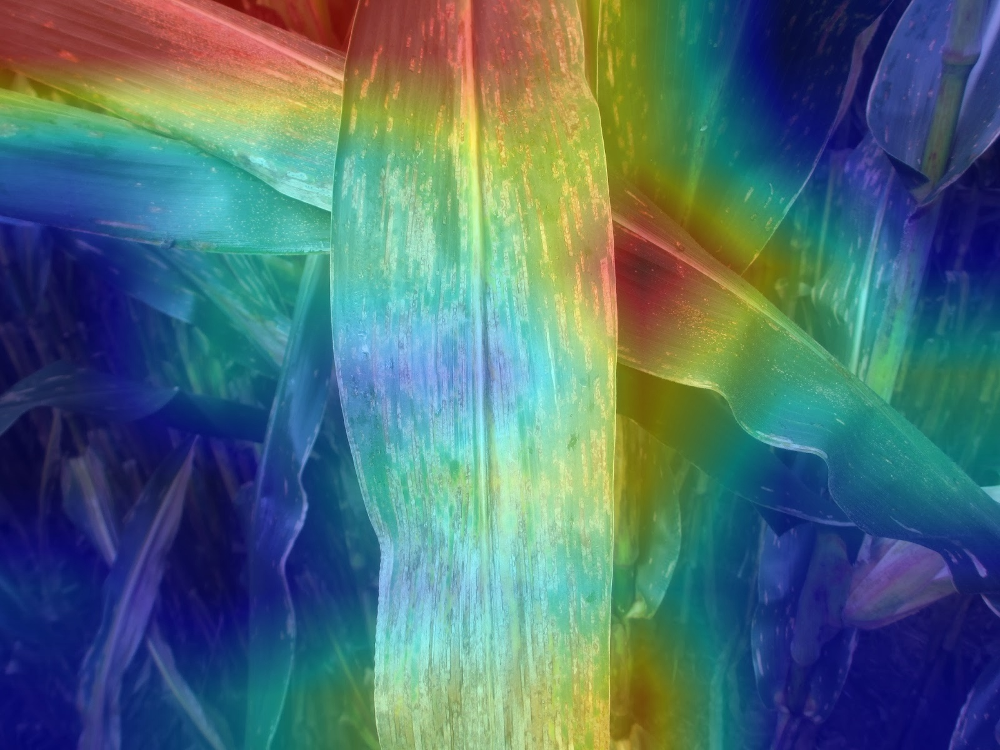

### Sample 4
- **True Class:** corn_leaf_blight
- **Predicted Class:** corn_gray_leaf_spot
- **Confidence:** 0.4443
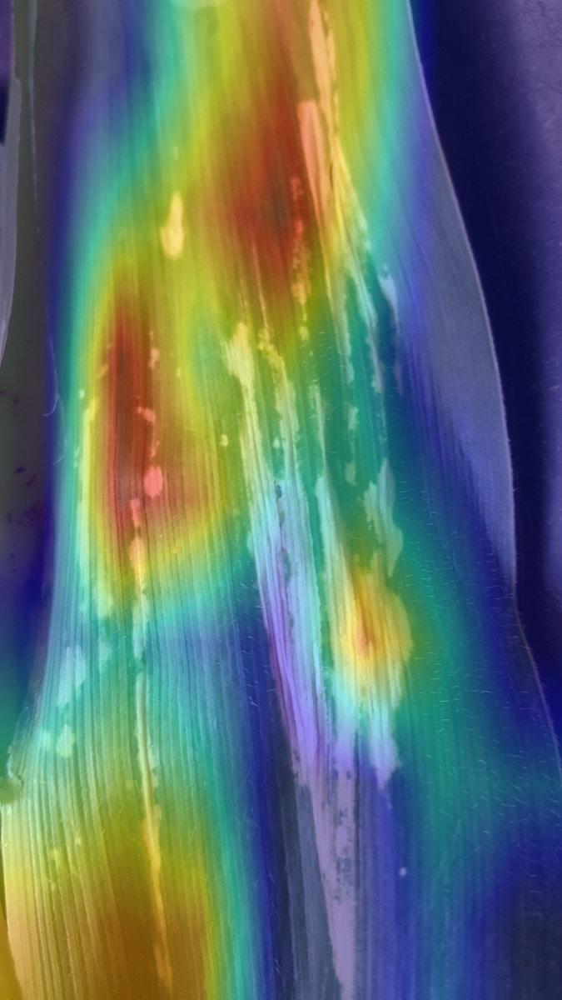

